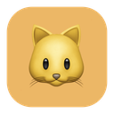
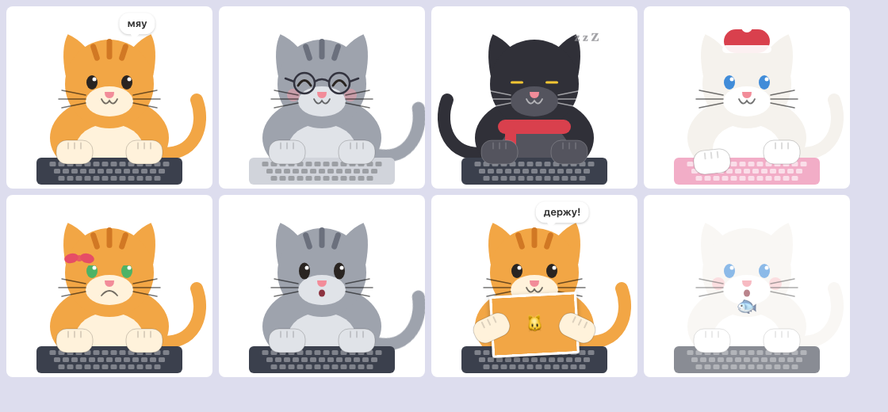
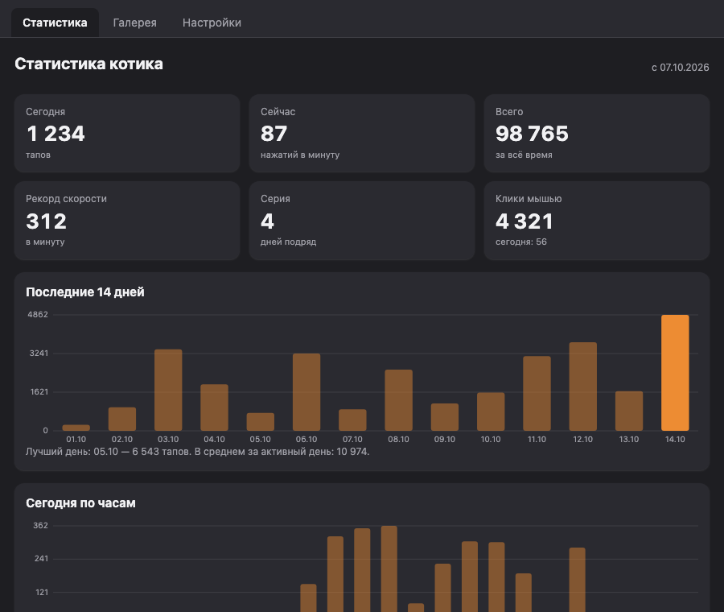

<div align="center">



# Cat Is Not Helper

**Котик, который сидит поверх всех окон и тапает лапками вместе с тобой.**
Он не помогает. Он тапает.

[](https://fgeeha.github.io/projects/cat-is-not-helper/)
[](https://github.com/Fgeeha/cat-is-not-helper/releases/latest)
[](https://github.com/Fgeeha/cat-is-not-helper/actions/workflows/build.yml)
[](https://github.com/Fgeeha/cat-is-not-helper/actions/workflows/desktop.yml)


</div>

---

## Содержание

- [Скачать](#скачать)
- [Что умеет](#что-умеет)
- [Управление](#управление)
- [Скриншоты](#скриншоты)
- [Обновления](#обновления)
- [Две реализации](#две-реализации)
- [Сборка из исходников](#сборка-из-исходников)
- [CI и релизы](#ci-и-релизы)
- [Приватность](#приватность)
- [Структура репозитория](#структура-репозитория)

## Скачать

Готовые сборки лежат в [Releases](https://github.com/Fgeeha/cat-is-not-helper/releases/latest).

| Платформа | Файл | Как поставить |
|---|---|---|
| **macOS 13+** (нативная) | `CatIsNotHelper-vX.Y.Z-universal.zip` | распаковать, перетащить в «Программы» |
| **macOS 11+** (Tauri) | `CatIsNotHelper_X.Y.Z_universal.dmg` | открыть dmg, перетащить в «Программы» |
| **Windows 10/11** | `CatIsNotHelper_X.Y.Z_x64-setup.exe` | запустить, ставится в профиль без прав администратора |
| **RedOS, Fedora, другие RPM** | `CatIsNotHelper-X.Y.Z-1.x86_64.rpm` | `sudo dnf install ./CatIsNotHelper-*.rpm` |
| **Debian, Ubuntu, Astra** | `CatIsNotHelper_X.Y.Z_amd64.deb` | `sudo apt install ./CatIsNotHelper_*.deb` |
| **Любой Linux** | `CatIsNotHelper_X.Y.Z_amd64.AppImage` | `chmod +x`, запустить; обновляется сам |

<details>
<summary>Первый запуск: разрешения и предупреждения</summary>

- **macOS** спросит «Универсальный доступ» (Accessibility): без него котик не видит нажатия в других приложениях. Если диалог не появился: Системные настройки → Конфиденциальность и безопасность → Универсальный доступ → добавить CatIsNotHelper. При первом скриншоте система попросит ещё «Запись экрана». Сборки из CI подписаны ad-hoc, поэтому Gatekeeper предупредит о неизвестном разработчике: правый клик по приложению → «Открыть», либо `xattr -d com.apple.quarantine CatIsNotHelper.app`.
- **Windows** никаких разрешений не требует. Установщик не подписан, SmartScreen покажет «Неизвестный издатель»: «Подробнее» → «Выполнить в любом случае».
- **Linux** читает нажатия в сессии **X11** (Xorg). В чистом Wayland протокол не даёт слушать клавиатуру глобально, котик об этом скажет сам. Зависимости rpm: `webkit2gtk4.1`, `gtk3`, `libXtst`, `libXi`.

</details>

## Что умеет

- **Тапает в такт.** Левая половина клавиатуры — левая лапа, правая — правая, пробел чередует, клик мышью — тоже лапа.
- **Живёт своей жизнью.** Моргает, засыпает через две минуты тишины, радуется и виляет хвостом, ворчит, если его забыли, бросает фразы в пузырьке, празднует каждую тысячу тапов.
- **Ведёт статистику.** Тапы за сегодня и за всё время, нажатий в минуту, рекорд скорости, серия дней подряд, графики за 14 дней и по часам.
- **Держит скриншоты.** Выдели область экрана прямо из меню котика, и он возьмёт картинку в лапки. Можно перетащить на него любую картинку. Чтобы забрать, просто потяни картинку из лапок в Finder, проводник или чат.
- **Галерея.** Все скриншоты в одной папке: дать котику, открыть, показать в папке, удалить.
- **Гладится и кормится.** Клик по котику гладит, в меню есть рыбка. Счастье влияет на настроение.
- **Настраивается.** Четыре окраса, цвет глаз, аксессуары (бантик, очки, шапка, шарф), цвет клавиатуры, зеркальное отражение, размер от 50% до 250%, прозрачность, автозапуск при входе в систему. В настройках живой превью.

## Управление

| Действие | Что делает |
|---|---|
| Клик по котику | погладить |
| Двойной клик | открыть то, что он держит |
| Потянуть за котика | передвинуть |
| Потянуть за картинку в лапках | забрать её (drag & drop наружу) |
| Перетащить картинку на котика | он возьмёт её в лапки |
| Правый клик | меню |
| Иконка 🐾 в меню-баре или трее | статистика, скриншот, галерея, размер, окрас, настройки, обновления |

## Скриншоты

<div align="center">

<br /><sub>Окрасы, аксессуары, настроения. Чёрный спит, серый в ударе, рыжий держит скриншот.</sub>
<br /><br />

<br /><sub>Статистика: карточки, 14 дней, по часам, настроение.</sub>
</div>

## Обновления

В меню котика есть пункт **«Проверить обновления»**. Если новая версия найдена, он превращается в «Обновить до vX» там, где приложение умеет обновляться само (macOS, Windows, AppImage), или в «Скачать vX на GitHub» для rpm и deb. Релизные сборки проверяют обновления сами: через 20 секунд после запуска и раз в 6 часов, это отключается в настройках.

- **Нативная macOS-версия** читает GitHub Releases напрямую, скачивает zip, подменяет свой бандл и перезапускается.
- **Tauri-версия** использует встроенный апдейтер с подписью minisign (`latest.json` в релизе). Если файла нет, версия сверяется через GitHub API и открывается страница релиза.

Статистика и настройки лежат отдельно от приложения и при обновлении не теряются.

## Две реализации

| | Платформы | Код | Стек |
|---|---|---|---|
| **Нативная** | macOS 13+ | `Sources/`, `Package.swift` | SwiftUI + AppKit, SwiftPM без Xcode-проекта |
| **Кросс-платформенная** | macOS 11+, Windows 10/11, Linux | `desktop/` | Tauri 2: Rust + HTML/JS без сборщика, котик в SVG |

Обе версии одинаково выглядят, ведут одну и ту же статистику (общий `stats.json`) и одну папку скриншотов. На macOS у них разные bundle id, поэтому разрешения выдаются каждой отдельно, а данные общие.

## Сборка из исходников

### Нативная macOS

Нужен Xcode 15+.

```bash
make app            # build/CatIsNotHelper.app под текущую архитектуру
make app-universal  # arm64 + x86_64 в одном бинарнике
make run            # собрать и запустить
make install        # скопировать в /Applications
```

Или вручную: `scripts/build-app.sh [debug|release]` с переменными `ARCHS="arm64 x86_64"`, `CODESIGN_IDENTITY`, `VERSION`, `RELEASE_BUILD=1`.

Скрипт подписывает бандл первым сертификатом «Apple Development» из связки ключей. Это важно: разрешение «Универсальный доступ» привязано к подписи, а ad-hoc подпись меняется при каждой пересборке, и котик перестаёт видеть клавиши. Если доступ всё же слетел: `tccutil reset Accessibility com.fgeeha.cat-is-not-helper`.

### Tauri (macOS, Windows, Linux)

Нужны Rust stable и Node 20+. На Linux ещё системные библиотеки, их список в `.github/workflows/desktop.yml`.

```bash
cd desktop
npm install
npm run dev                     # запуск с горячей перезагрузкой интерфейса
npm run build                   # установщики в desktop/src-tauri/target/release/bundle/
npm run build -- --bundles rpm  # только rpm (на Linux)
```

На macOS локальную сборку тоже стоит подписывать стабильным сертификатом:

```bash
APPLE_SIGNING_IDENTITY="Apple Development: you@example.com (TEAMID)" npm run build
```

<details>
<summary>Как устроена Tauri-версия</summary>

Бэкенд на Rust: глобальный монитор ввода через `rdev`, статистика в том же JSON, что у Swift, скриншоты через собственный оверлей выделения области и `xcap` на macOS и Windows или напрямую через X11 на Linux, трей, настройки, апдейтер. Интерфейс на обычном HTML/JS: `ui/cat-renderer.js` рисует котика в SVG в тех же координатах 260×230 и отвечает за его характер, `ui/panel.*` — вкладки статистики, галереи и настроек. Единственная npm-зависимость — CLI Tauri.

</details>

## CI и релизы

Два workflow в `.github/workflows/`:

- **`build.yml`** собирает нативную macOS-версию (universal), проверяет архитектуры, подпись и отладочный рендер котика.
- **`desktop.yml`** собирает Tauri-версию матрицей: macOS universal, Windows x64, Linux x64 (rpm, deb, AppImage).

На каждый пуш в Master результаты доступны как артефакты в Actions. Тег `v*` публикует релиз со всеми файлами:

```bash
git tag v1.2.0 && git push origin v1.2.0
```

<details>
<summary>Секреты репозитория (необязательно)</summary>

| Секрет | Зачем |
|---|---|
| `TAURI_SIGNING_PRIVATE_KEY`, `TAURI_SIGNING_PRIVATE_KEY_PASSWORD` | подпись артефактов апдейтера Tauri и генерация `latest.json`; без них релиз выйдет, но Tauri-версия не будет обновляться сама. Пара создаётся `npx tauri signer generate -w ~/.tauri/cat-is-not-helper.key`, публичный ключ уже в `tauri.conf.json` |
| `MACOS_CERT_P12_BASE64`, `MACOS_CERT_PASSWORD`, `MACOS_CERT_IDENTITY` | стабильная подпись macOS-сборок, чтобы разрешение «Универсальный доступ» переживало обновления. Достаточно самоподписанного сертификата типа «Подпись кода», экспортированного в `.p12` |

</details>

## Приватность

Котик считает только **количество** нажатий и час, в который они произошли. Какие именно клавиши нажаты — не записывается, не хранится и никуда не отправляется. Всё лежит локально:

| Что | Где |
|---|---|
| Статистика | `~/Library/Application Support/CatIsNotHelper/stats.json` · `%APPDATA%\CatIsNotHelper\stats.json` · `~/.local/share/CatIsNotHelper/stats.json` |
| Скриншоты | `~/Pictures/CatIsNotHelper` (`Изображения` на Windows и Linux) |

В сеть приложение ходит только за проверкой обновлений на GitHub, и это отключается в настройках.

## Структура репозитория

```
Sources/CatIsNotHelper/      нативная macOS-версия (SwiftUI + AppKit)
scripts/                     сборка .app и иконки
desktop/ui/                  интерфейс Tauri-версии: котик в SVG, панель, оверлей скриншота
desktop/src-tauri/src/       бэкенд Tauri-версии на Rust
.github/workflows/           CI: build.yml (macOS native), desktop.yml (Tauri)
docs/                        картинки для этого README
```
